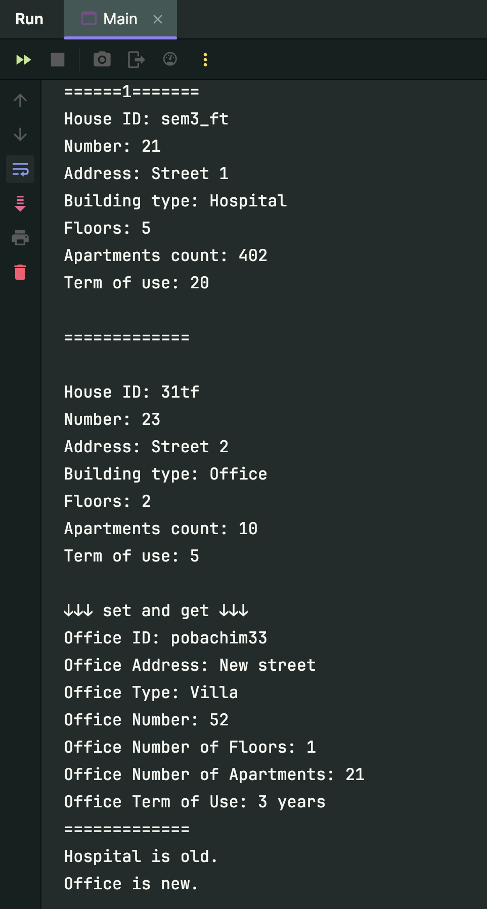
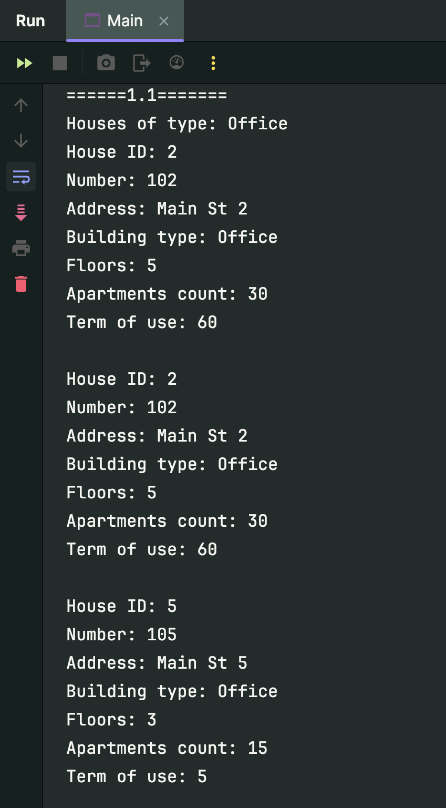
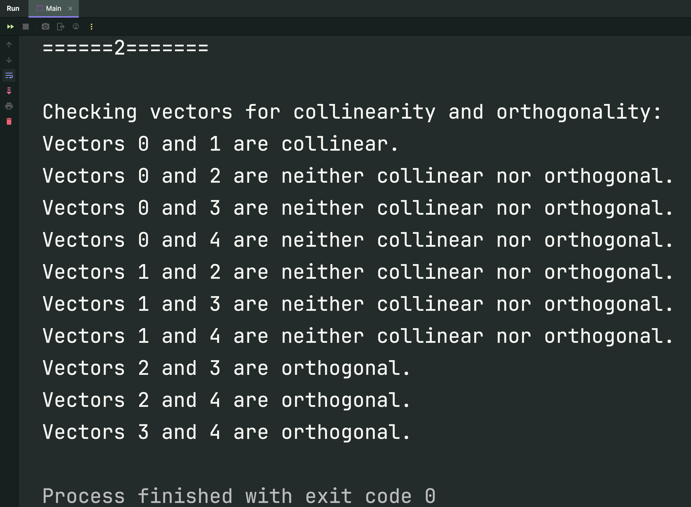

# Модульна контрольна робота №1 з OOP-Java

## Завдання:
Створити описаний нижче клас. Визначити конструктор і методи `set()`, `get()`, `show()`. Визначити додатково будь-який метод для класу. Реалізувати клас у консольному додатку. Задати критерій вибору даних і вивести ці дані в консоль.

**_House: id, номер, адреса, тип будівлі, кількість поверхів, кількість квартир, термін експлуатації._**

Визначити клас `Vector` розмірності n. Оголосити масив з m об’єктів. Кожну з пар векторів передати в метод, який визначає, чи будуть ці вектора колінеарні або ортогональні. Вивести ортогональні та колінеарні вектори.

## Висновок: 


**З таким вмістом в Main:**
```java
public class Main {
   public static void main(String[] args) {

      System.out.println("======1=======");

      House hospital = new House("sem3_ft", 21, "Street 1", "Hospital", 5, 402, 20);
      House office = new House("31tf", 23, "Street 2", "Office", 2, 10, 5);

      hospital.show();
      System.out.println("\n=============\n");
      office.show();

      System.out.println("\n↓↓↓ set and get ↓↓↓");
      office.setId("pobachim33");
      office.setNumber(52);
      office.setAddress("New street");
      office.setBuildingType("Villa");
      office.setFloors(1);
      office.setApartmentsCount(21);
      office.setTermOfUse(3);

      String newOfficeId = office.getId();
      String newOfficeAddress = office.getAddress();
      String newOfficeType = office.getBuildingType();
      int newOfficeNumber = office.getNumber();
      int newOfficeFloors = office.getFloors();
      int newOfficeApartmentsCount = office.getApartmentsCount();
      int newOfficeTermOfUse = office.getTermOfUse();

      System.out.printf(
              "Office ID: %s%nOffice Address: %s%nOffice Type: %s%nOffice Number: %d%nOffice Number of Floors: %d%nOffice Number of Apartments: %d%nOffice Term of Use: %d years%n",
              newOfficeId, newOfficeAddress, newOfficeType, newOfficeNumber, newOfficeFloors, newOfficeApartmentsCount, newOfficeTermOfUse
      );


      System.out.println("=============");
      hospital.setTermOfUse(52);

      // Перевірка на старість будівлі
      System.out.println(hospital.isOldBuilding() ? "Hospital is old." : "Hospital is new.");
      System.out.println(office.isOldBuilding() ? "Office is old." : "Office is new.");


      System.out.println("\n======1.1=======");
      String selectedType = "Office";  // Встановлення типу будинку за замовчуванням

      // Створення масиву будинків
      House[] houses = {
              hospital,
              office,
              new House("1", 101, "Main St 1", "Apartment", 10, 50, 45),
              new House("2", 102, "Main St 2", "Office", 5, 30, 60),
              new House("3", 103, "Main St 3", "Apartment", 12, 80, 55),
              new House("1", 101, "Main St 1", "Apartment", 10, 50, 45),
              new House("2", 102, "Main St 2", "Office", 5, 30, 60),
              new House("3", 103, "Main St 3", "Apartment", 12, 80, 55),
              new House("4", 104, "Main St 4", "Villa", 2, 10, 10),
              new House("5", 105, "Main St 5", "Office", 3, 15, 5)
      };

      System.out.println("Houses of type: " + selectedType);
      boolean found = false;

      // Вивід інформації про будинки за критерієм
      for (House house : houses) {
         if (house.getBuildingType().equalsIgnoreCase(selectedType)) {
            house.show();
            System.out.println();

            found = true;
         }
      }

      System.out.print(!found ? "No houses found of type: " + selectedType : "");


      System.out.println("======2=======");
      // Жорстке задання масиву векторів
      Vector[] vectors = {
              new Vector(1, 2, 3),
              new Vector(2, 4, 6),
              new Vector(1, 0, 0),
              new Vector(0, 1, 0),
              new Vector(0, 0, 1)
      };

      // Перевірка на колінеарність та ортогональність
      System.out.println("\nChecking vectors for collinearity and orthogonality:");
      for (int i = 0; i < vectors.length - 1; i++) {
         for (int j = i + 1; j < vectors.length; j++) {
            Vector v1 = vectors[i];
            Vector v2 = vectors[j];

            if (Vector.areCollinear(v1, v2)) {
               System.out.println("Vectors " + i + " and " + j + " are collinear.");
            } else if (Vector.areOrthogonal(v1, v2)) {
               System.out.println("Vectors " + i + " and " + j + " are orthogonal.");
            } else {
               System.out.println("Vectors " + i + " and " + j + " are neither collinear nor orthogonal.");
            }
         }
      }

   }
}

```

**Результат:**



